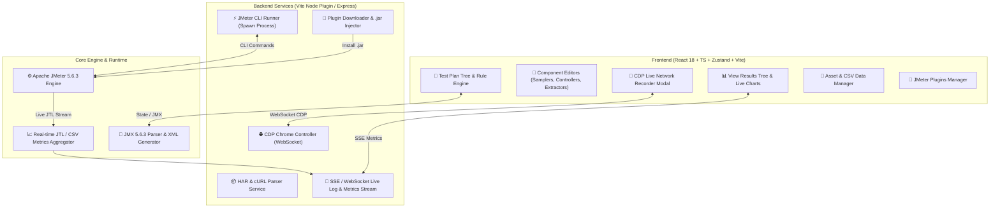
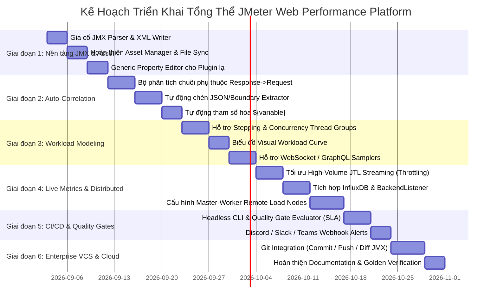

# Master Implementation Plan: Nền Tảng JMeter Web Studio & Enterprise Performance Testing Platform

Tài liệu này cung cấp bản kế hoạch tổng thể hoàn chỉnh, chuyên sâu và chuẩn công nghiệp (Production-Grade Master Plan) cho dự án **JMeter Web UI / Studio & Live Load Testing Platform** (`Project_Jmeter`). Kế hoạch được thiết kế có cấu trúc rõ ràng theo từng giai đoạn, phân tách rõ module, giao diện, backend service, và cơ chế kiểm thử để người dùng dễ dàng sắp xếp và thực hiện.

---

## 1. Kiến Trúc Tổng Thể Hệ Thống (System Architecture)

Hệ thống được xây dựng theo mô hình **Modern Web-Based Performance Engineering Platform**, hợp nhất toàn bộ quy trình: *Record (Ghi tương tác) $\rightarrow$ Model (Soạn thảo Test Plan) $\rightarrow$ Correlate (Tự động hóa biến) $\rightarrow$ Execute (Chạy tải thực tế) $\rightarrow$ Analyze (Phân tích chỉ số Live & HTML Report)*.



---

## 2. Ma Trận Đánh Giá Hiện Trạng & Mục Tiêu (Gap Analysis)

| Hạng Mục | Hiện Trạng (Current State) | Mục Tiêu Chuẩn Doanh Nghiệp (Target Enterprise State) | Độ Ưu Tiên |
|---|---|---|---|
| **Soạn thảo JMX** | Đã hỗ trợ Core Samplers, Controllers, Extractors, Assertions, Timers. | Hỗ trợ 100% components thông dụng + Generic Key-Value Editor cho mọi XML tag lạ. | **P0** (Đã đạt 95%) |
| **Ghi lưu lượng (Recording)** | CDP WebSocket bắt request từ byte đầu tiên, lọc rác, redact dữ liệu nhạy cảm. | Tự động phân tích chuỗi tương quan (Auto-Correlation AI: Token, Session, CSRF). | **P1** (Kế hoạch Giai đoạn 2) |
| **Sinh tải (Execution)** | Chạy JMeter CLI đơn máy cục bộ, stream log JTL thời gian thực. | Hỗ trợ chạy phân tán Master-Worker (Distributed Remote Nodes) & Docker/K8s Agents. | **P1** (Kế hoạch Giai đoạn 4) |
| **Chỉ số Live (Live Metrics)** | Tính toán Throughput, Latency avg/min/max, Error rate trên frontend. | Biểu đồ Live Percentiles (P90, P95, P99), Error Breakdown, Tích hợp InfluxDB/Grafana. | **P1** (Kế hoạch Giai đoạn 4) |
| **Tự động hóa (CI/CD)** | Chạy qua giao diện Web UI. | Cung cấp REST API & Headless CLI Runner + SLA Quality Gates đánh giá tự động. | **P2** (Kế hoạch Giai đoạn 5) |
| **Quản trị Test Data** | Upload CSV cục bộ qua Asset Manager. | Quản lý dataset tập trung, sinh dữ liệu ngẫu nhiên, tự động chia sẻ file lên remote nodes. | **P0** (Hoàn thiện Giai đoạn 1) |

---

## 3. Lộ Trình Triển Khai 6 Giai Đoạn (Master Implementation Roadmap)



---

## 4. Chi Tiết Kỹ Thuật Từng Giai Đoạn (Technical Specifications)

### 🔹 GIAI ĐOẠN 1: Chuẩn Hóa Lõi JMX & Quản Trị Asset (Core Foundation & Data)
*Mục tiêu: Đảm bảo 100% file `.jmx` tạo ra tương thích hoàn hảo với Apache JMeter 5.6.3 chính thức, quản lý tập trung toàn bộ file CSV và hỗ trợ chỉnh sửa thuộc tính plugin ngách.*

#### Nhiệm vụ cụ thể:
1. **Gia cố Bộ Chuyển Đổi JMX (`src/jmx/writer.ts` & `src/jmx/parser.ts`):**
   - Đảm bảo các tham số `TransactionController`, `HTTPRequestDefaults`, `HeaderManager`, `CookieManager`, `CSVDataSet` xuất ra đúng cấu trúc XML tag của Apache JMeter.
   - Xử lý tách bạch `postBodyRaw` (cho JSON/XML) vs `parameters` (cho Form URL-Encoded).
2. **Generic Key-Value Property Editor (`src/editors/GenericPropertyEditor.tsx`):**
   - Đối với các plugin hoặc component chưa có UI chuyên biệt (`UnsupportedComponent`), hiển thị bảng danh sách thuộc tính XML (StringProp, BoolProp, IntProp, ElementProp) cho phép tester chỉnh sửa trực tiếp trên giao diện thay vì mở XML thô.
3. **Hoàn thiện Asset Manager & Tự Động Hóa Đường Dẫn File (`src/services/projectAssetService.ts`):**
   - Quản lý file CSV test data trong workspace `data/`.
   - Tự động thay thế đường dẫn tuyệt đối (`C:\Users\...`) thành biến relative hoặc `${__P(data.dir, .)}/users.csv` để chạy được trên mọi máy.

---

### 🔹 GIAI ĐOẠN 2: Tự Động Hóa Tương Quan Biến Thông Minh (Smart Auto-Correlation Engine)
*Mục tiêu: Giải quyết bài toán tốn thời gian nhất của Performance Tester – Tự động phát hiện Token, Session ID, Dynamic ID trong response của request trước và truyền vào request sau.*

#### Kiến trúc Auto-Correlation:
```
[Recorded Requests Flow]
       │
       ▼
[Scanner: Tìm kiếm token/id trong Header/Body/Cookie]
       │
       ▼
[Correlation Rule Engine: Đối chiếu giá trị xuất hiện ở Request N+1 với Response Request N]
       │
       ├──> [1. Tự chèn JSONExtractor / BoundaryExtractor vào Request N]
       └──> [2. Tự thay thế giá trị cố định thành ${AUTH_TOKEN} tại Request N+1]
```

#### Nhiệm vụ cụ thể:
1. **Thuật toán quét chuỗi tương quan (`src/utils/correlationDetector.ts`):**
   - Quét các trường phổ biến: `token`, `access_token`, `jwt`, `sessionId`, `csrf`, `_csrf`, `id`, `orderId`, `ticket`.
   - So khớp chuỗi: Nếu giá trị chuỗi (độ dài >= 8 ký tự) xuất hiện trong Response Body/Header của Request $A$ và được gửi lại trong Request $B$ (ở Header hoặc Body), tự động đánh dấu quan hệ cha - con.
2. **Trình hướng dẫn Tương quan 1-Click (Correlation Wizard UI):**
   - Hiển thị danh sách các biến động được phát hiện sau khi Record.
   - Cho phép tester tích chọn các biến muốn tự động extract -> Bấm "Apply Correlation" để hệ thống tự động chèn Extractor và parameterize toàn bộ kịch bản.

---

### 🔹 GIAI ĐOẠN 3: Mô Hình Hóa Tải Nâng Cao & Đa Giao Thức (Workload Modeling & Protocols)
*Mục tiêu: Cho phép thiết lập các mô hình tải thực tế (Spike, Step-up, Stress, Soak testing) và hỗ trợ đa dạng giao thức ngoài HTTP.*

#### Nhiệm vụ cụ thể:
1. **Bộ Thread Groups Nâng Cao (Custom Thread Groups):**
   - Tích hợp mô hình `ConcurrencyThreadGroup`, `SteppingThreadGroup`, `UltimateThreadGroup`.
   - Cung cấp đồ thị trực quan (Visual Curve Preview) hiển thị số lượng Virtual Users theo thời gian ngay khi chỉnh sửa cấu hình (Ramp-up time, Hold target rate, Step count).
2. **Mở rộng giao thức Samplers (`src/editors/Protocols/`):**
   - **WebSocket Samplers:** Hỗ trợ Open Connection, Single Write/Read Text, Close Connection.
   - **GraphQL Sampler:** Tích hợp bộ soạn thảo Query/Mutation và Variables riêng biệt.
   - **gRPC / TCP Samplers:** Soạn thảo proto payload và host/port.

---

### 🔹 GIAI ĐOẠN 4: Phân Tán Tải & Giám Sát Chỉ Số Live Chuyên Sâu (Distributed & APM)
*Mục tiêu: Khả năng sinh tải lớn hàng chục ngàn VU qua mạng phân tán và giám sát live metrics không bị lag trình duyệt.*

#### Nhiệm vụ cụ thể:
1. **Kiến trúc High-Volume Metrics Streaming (`server/jmeterRunner.ts`):**
   - Áp dụng kỹ thuật **Batch Aggregation & Throttling**: Server tính toán trước các chỉ số thống kê (P50, P90, P95, P99, Throughput, Error Rate) theo cửa sổ thời gian 1 giây, chỉ đẩy tóm tắt về Web thay vì đẩy từng raw sample.
   - Áp dụng **Virtual Scrolling** trong `ViewResultsTree.tsx` để render mượt mà hàng triệu sample.
2. **Tích hợp Backend Listener & InfluxDB / Prometheus:**
   - Hỗ trợ 1-click thêm `BackendListener` vào Test Plan kết nối tới InfluxDB / Prometheus.
   - Hiển thị dashboard nhúng Grafana hoặc biểu đồ Canvas/SVG live ngay trong Web Studio.
3. **Điều phối Phân tán (Distributed Load Testing Coordinator):**
   - Giao diện cấu hình danh sách Remote IP Workers (`remote_hosts`).
   - Tự động nạp lệnh `jmeter -n -t ... -R 192.168.1.10,192.168.1.11 -l ...` và thu thập kết quả hợp nhất về Dashboard.

---

### 🔹 GIAI ĐOẠN 5: Tích Hợp CI/CD & Đánh Giá Tiêu Chuẩn Chất Lượng (Quality Gates & SLA)
*Mục tiêu: Đưa kiểm thử hiệu năng vào quy trình phát triển liên tục (Continuous Performance Testing), tự động chặn release nếu hiệu năng sụt giảm.*

#### Nhiệm vụ cụ thể:
1. **Định nghĩa Bộ Tiêu Chuẩn Hiệu Năng (SLA Quality Gates Definition):**
   - Cho phép định nghĩa ngưỡng chấp nhận (Thresholds) cho từng Transaction hoặc toàn bộ Test Plan:
     - `Avg Response Time <= 300ms`
     - `P95 Response Time <= 800ms`
     - `Error Rate <= 0.5%`
     - `Min Throughput >= 500 req/s`
2. **Headless Execution API & Webhook Notification:**
   - Cung cấp REST endpoint `POST /api/run-headless` trả về Exit Code (0: Passed, 1: SLA Violated, 2: System Error) cho Jenkins / GitHub Actions.
   - Tự động sinh báo cáo tóm tắt và bắn thông báo qua Discord Webhook / Slack / Microsoft Teams kèm biểu đồ thống kê.

---

### 🔹 GIAI ĐOẠN 6: Quản Trị Phiên Bản & Hợp Tác Nhóm (Version Control & Cloud Collaboration)
*Mục tiêu: Quản lý kịch bản kiểm thử theo nhóm, đồng bộ Git và phân quyền dự án.*

#### Nhiệm vụ cụ thể:
1. **Tích hợp Git Trực Tiếp Trên Web Studio (`src/services/gitService.ts`):**
   - Thao tác: Git Status, Commit, Push, Pull, Switch Branch cho các file `.jmx` và `data/*.csv`.
   - **JMX Visual Diff Viewer:** So sánh sự khác biệt giữa 2 phiên bản kịch bản test dưới dạng cây Component trực quan thay vì so sánh diff XML thô.
2. **Kho Mẫu Kịch Bản Chuẩn (Template Gallery):**
   - Cung cấp sẵn các mẫu kịch bản phổ biến: *E-commerce Checkout Flow*, *API Microservices Smoke Load*, *OAuth2 Login & Session Soak Test*, *File Upload Stress Test*.

---

## 5. Phân Bổ Danh Sách Files Cần Triển Khai (File Structure Mapping)

```
Project_Jmeter/
├── src/
│   ├── components/
│   │   ├── common/
│   │   │   ├── BrowserRecorderModal.tsx       # [Gia cố] Modal ghi live CDP
│   │   │   ├── CorrelationWizardModal.tsx      # [MỚI - Giai đoạn 2] Trình tương quan biến tự động
│   │   │   ├── GenericPropertyEditor.tsx       # [MỚI - Giai đoạn 1] Editor cho component lạ
│   │   │   ├── SlaSettingsModal.tsx            # [MỚI - Giai đoạn 5] Cấu hình Quality Gates SLA
│   │   │   ├── GitManagerModal.tsx             # [MỚI - Giai đoạn 6] Git Commit/Push/Diff
│   │   │   └── WorkloadGraphModal.tsx          # [MỚI - Giai đoạn 3] Biểu đồ Virtual Users Curve
│   │   ├── results/
│   │   │   ├── ViewResultsTree.tsx             # [Tối ưu - Giai đoạn 4] Virtual scroll mượt mà
│   │   │   └── LiveMetricsDashboard.tsx        # [MỚI - Giai đoạn 4] Live Percentiles & Throughput
│   ├── jmx/
│   │   ├── parser.ts                           # [Gia cố] Đọc chuẩn XML 5.6.3
│   │   └── writer.ts                           # [Gia cố] Ghi chuẩn XML 5.6.3
│   ├── utils/
│   │   ├── correlationDetector.ts              # [MỚI - Giai đoạn 2] Thuật toán phát hiện token/biến
│   │   ├── slaEvaluator.ts                     # [MỚI - Giai đoạn 5] Đánh giá pass/fail theo SLA
│   │   └── jtlParser.ts                        # [Tối ưu] Parser tốc độ cao cho file JTL lớn
├── server/
│   ├── browserRecorder.ts                      # [Gia cố] WebSocket CDP controller & sanitize
│   ├── jmeterRunner.ts                         # [Nâng cấp] Distributed & Headless CLI execution
│   └── pluginsManager.ts                       # [Gia cố] Tải & quản lý thư viện .jar
└── tests/
    ├── verify-jmeter-cli.mjs                   # [Kiểm thử] Nghiệm thu CLI & HTML Report
    ├── verify-auto-correlation.mjs             # [MỚI] Kiểm thử trích xuất biến tự động
    └── fixtures/                               # JMX & JTL golden files
```

---

## 6. Kế Hoạch Kiểm Thử & Tiêu Chuẩn Hoàn Thành (Definition of Done - DoD)

Mỗi giai đoạn chỉ được coi là hoàn tất khi đáp ứng 100% các tiêu chí nghiệm thu sau:

1. **Static Typing & Build:**
   ```bash
   npm run typecheck && npm run build
   ```
   $\rightarrow$ Đạt **0 lỗi TypeScript, 0 cảnh báo ESLint**.
2. **Nghiệm Thu Khởi Chạy Thực Tế (Apache JMeter Compatibility):**
   - Mọi file `.jmx` xuất ra đều mở được trên **Apache JMeter GUI 5.6.3** mà không sinh bất kỳ popup cảnh báo lỗi XML parse nào.
   - Mọi kịch bản đều chạy thành công trên **JMeter Non-GUI CLI (`jmeter -n -t ...`)** và sinh đầy đủ báo cáo HTML Dashboard.
3. **Hiệu Năng & Độ Ổn Định (Stability & Performance):**
   - Live Recorder bắt 100% request từ byte đầu tiên, không để lại tiến trình Chrome chạy ngầm hay file rác.
   - Giao diện Live Stream chịu tải hiển thị trên 100.000 samples mà không gây đơ/treo tab trình duyệt.

---

## 7. Đề Xuất Phân Bổ Sắp Xếp Công Việc (Suggested Schedule)

| Tuần / Sprint | Mục Tiêu Triển Khai | Kết Quả Đầu Ra (Deliverables) |
|---|---|---|
| **Sprint 1 (Tuần 1)** | **Giai đoạn 1: Nền tảng JMX & Data** | Hoàn thiện JMX Writer/Parser 100% chuẩn, Generic XML Property Editor, Quản lý CSV Asset. |
| **Sprint 2 (Tuần 2)** | **Giai đoạn 2: Smart Auto-Correlation** | Thuật toán phát hiện token tự động, Giao diện 1-Click Correlation Wizard, Tự chèn Extractor. |
| **Sprint 3 (Tuần 3)** | **Giai đoạn 3: Workload Curve & Protocols** | Biểu đồ Virtual Users Ramp-up curve, Concurrency & Stepping Thread Groups, WebSocket support. |
| **Sprint 4 (Tuần 4)** | **Giai đoạn 4: Live Metrics & Distributed** | High-volume JTL Stream Throttling, Biểu đồ Live Percentiles, Cấu hình Remote Load Nodes. |
| **Sprint 5 (Tuần 5)** | **Giai đoạn 5: CI/CD & Quality Gates** | Headless CLI runner, SLA Quality Gates evaluator, Bắn thông báo Discord/Slack tự động. |
| **Sprint 6 (Tuần 6)** | **Giai đoạn 6: Git VCS & Hoàn Thiện** | Trình quản lý Git JMX trực quan, Visual Diff Viewer, Template Gallery & Golden Tests. |
