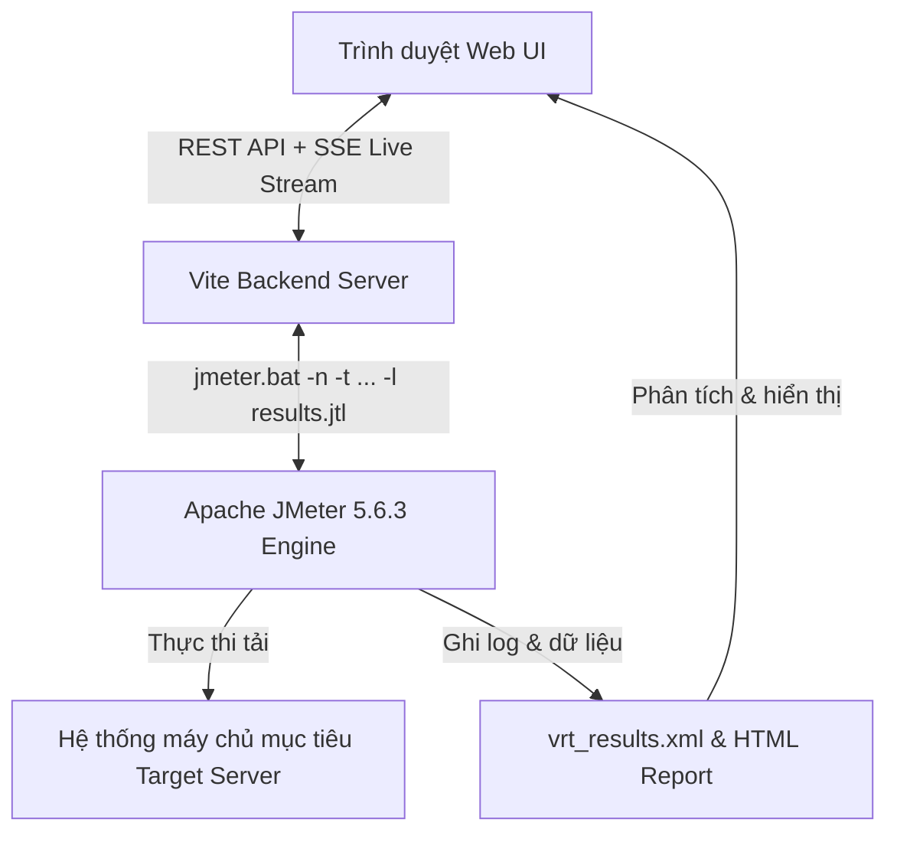

# 📖 Hướng Dẫn Sử Dụng & Sổ Tay Tính Năng JMeter Web UI
> **Tài liệu hướng dẫn trực quan toàn diện (Visual User Guide & Technical Manual)**  
> Dành cho Performance Tester / QA / Automation Engineer sử dụng **JMeter Web UI** kèm đầy đủ hình ảnh minh họa thực tế từ trình duyệt.

---

## 📑 Mục lục
1. [Giới thiệu tổng quan & Giao diện chính](#1-giới-thiệu-tổng-quan--giao-diện-chính)
2. [Quản lý Cây kịch bản kiểm thử (Test Plan Tree) & Kéo thả](#2-quản-lý-cây-kịch-bản-kiểm-thử-test-plan-tree--kéo-thả)
3. [Tính năng Import từ cURL (Tools -> Import from cURL)](#3-tính-năng-import-từ-curl-tools---import-from-curl)
4. [Trình xem kết quả (View Results Tree) chuẩn Apache JMeter](#4-trình-xem-kết-quả-view-results-tree-chuẩn-apache-jmeter)
5. [Trình quản lý Plugins (JMeter Plugins Manager)](#5-trình-quản-lý-plugins-jmeter-plugins-manager)
6. [Thực thi, Giám sát Console & Điều khiển Runner (Stop / Force Stop)](#6-thực-thi-giám-sát-console--điều-khiển-runner-stop--force-stop)
7. [Trình soạn thảo mã (Code Editor) cho JSON & Groovy JSR223](#7-trình-soạn-thảo-mã-code-editor-cho-json--groovy-jsr223)
8. [Cơ chế tự động đồng bộ dữ liệu & File CSV (Asset Sync)](#8-cơ-chế-tự-động-đồng-bộ-dữ-liệu--file-csv-asset-sync)
9. [Bảng tổng hợp Phím tắt (Keyboard Shortcuts)](#9-bảng-tổng-hợp-phím-tắt-keyboard-shortcuts)

---

## 1. Giới thiệu tổng quan & Giao diện chính

**JMeter Web UI** là nền tảng giao diện web hiện đại, mượt mà và trực quan được xây dựng trên **React, TypeScript và Vite**, kết nối trực tiếp với **Apache JMeter Engine** trên máy tính:

### 📸 Giao diện tổng quan của hệ thống:

### 2 Chế độ thực thi:
1. **Real JMeter Execution Mode (Chế độ thật)**:
   - Hệ thống tự động phát hiện bản cài đặt Apache JMeter trên máy (ví dụ `apache-jmeter-5.6.3`).
   - Biên dịch Test Plan thành file `.jmx` và khởi chạy tiến trình Java JMeter Non-GUI (`jmeter.bat -n -t ...`).
   - Tự động sinh báo cáo HTML Dashboard Report và ghi log thời gian thực.
2. **Mock Simulation Mode (Chế độ mô phỏng)**:
   - Chạy mô phỏng không cần Java/JMeter, thích hợp để dựng kịch bản, kiểm tra luồng logic nhanh.

> [!TIP]
> Bạn có thể bấm vào huy hiệu **Mode Badge** ở góc trên bên phải thanh công cụ để mở hộp thoại cấu hình môi trường JMeter bất cứ lúc nào.

---

## 2. Quản lý Cây kịch bản kiểm thử (Test Plan Tree) & Kéo thả

Cây kịch bản bên trái quản lý toàn bộ cấu trúc phân cấp của Test Plan theo chuẩn Apache JMeter.

### 2.1. Menu chuột phải (Context Menu) & Thêm thành phần
Click chuột phải vào bất kỳ node nào trên cây để mở menu thao tác phân cấp chuẩn JMeter:
- **Add**: Phân loại theo từng nhóm thành phần chuẩn (*Threads, Samplers, Logic Controllers, Pre Processors, Post Processors, Assertions, Timers, Config Elements, Listeners*).
- **Import from cURL…**: Nhập câu lệnh cURL trực tiếp vào vị trí đang chọn.
- **Cut (`Ctrl+X`) / Copy (`Ctrl+C`) / Paste (`Ctrl+V`) / Duplicate (`Ctrl+D`)**.
- **Remove (`Delete`) / Disable / Enable / Rename (`F2`)**.
- **Move to Top / Move Up / Move Down / Move to Bottom**.

### 2.2. Thao tác Kéo & Thả (Drag & Drop)
- **Sắp xếp thứ tự**: Kéo một component thả lên trên hoặc dưới component khác để đổi vị trí.
- **Di chuyển vào container**: Kéo Sampler/Timer thả vào bên trong một Thread Group hoặc Logic Controller.
- **Kéo thả File từ máy tính**: Kéo file `.jmx`, `.jtl`, `.csv`, `.xml` từ Windows Explorer thả trực tiếp vào cửa sổ trình duyệt để tự động nạp dữ liệu.

---

## 3. Tính năng Import từ cURL (Tools -> Import from cURL)

Cho phép nhập nhanh bất kỳ yêu cầu API nào từ DevTools của trình duyệt hoặc Postman thành component của JMeter.

### 3.1. Mở menu Import from cURL
Truy cập menu **`Tools -> Import from cURL…`** (hoặc click chuột phải trên cây -> `Import from cURL…`, hoặc bấm nút cURL trên Toolbar):

---

### 3.2. Hộp thoại Live Preview cURL
Dán câu lệnh cURL vào ô nhập liệu. Hệ thống sẽ **Live Preview** tách toàn bộ Method, Domain, Path, Headers và Body Data theo thời gian thực:

---

### 3.3. Tự động sinh HTTP Request & HTTP Header Manager
Bấm **Import into Test Plan**, hệ thống sẽ tự động tạo sampler **`HTTP Request`** và node con **`HTTP Header Manager`** tương ứng:

---

## 4. Trình xem kết quả (View Results Tree) chuẩn Apache JMeter

Bộ hiển thị kết quả chi tiết của JMeter được tái hiện đầy đủ với 3 tab:

### 4.1. Tab Sampler Result
Xem toàn bộ thông số chi tiết: Mã phản hồi (`200 OK`, `500`), Load time, Connect time, Latency, Data size, Headers size, Content type.

---

### 4.2. Tab Request & Tự động sinh cURL Code Snippet (Chuẩn Postman)
Hiển thị đầy đủ thông tin gửi đi với cấu trúc **Code snippet cURL** giống hệt Postman:
- Tự động tách từng `--header '<name>: <value>' \` trên mỗi dòng.
- Định dạng JSON Body trong `--data-raw '{ ... }'`.
- Nút **Copy cURL** sao chép trực tiếp lệnh CLI để chạy ngay trong Terminal hoặc import vào Postman/Insomnia.

---

### 4.3. Tab Response data (Giao diện chuẩn Postman & JMeter)
Tái hiện trung thực giao diện Response Inspector phong cách Postman:
- **Thanh trạng thái đầu trang**: Hiển thị trực quan mã **`200 OK`**, thời gian phản hồi (**`894 ms`**), kích thước (**`29.81 KB`**) và nút **`Save Response`** (tải tệp `.json`).
- **Các tab phụ**: **`Body`**, **`Cookies`**, **`Headers (7)`**, **`Test Results (Pass/Fail)`**.
- **Bộ công cụ xem JSON**: Hỗ trợ chuyển đổi **`JSON (Pretty)`**, **`Raw`**, **`Preview`**, thanh tìm kiếm nội dung và nút sao chép nhanh.
- **Tự động giải mã Unicode tiếng Việt**: Toàn bộ ký tự tiếng Việt có dấu được giải mã chuẩn xác, hiển thị trực quan và dễ đọc.

---

## 5. Trình quản lý Plugins (JMeter Plugins Manager)

Tương thích hoàn toàn với hệ sinh thái mở rộng của `jmeter-plugins.org`.

### Vị trí mở:
- Menu **`Options -> Plugins Manager…`** hoặc **`Tools -> Plugins Manager…`**

---

### 5.1. Tab Available Plugins (Kho Plugin chính thức)
Kho plugin phong phú (*Custom Thread Groups, Dummy Sampler, Throughput Shaping Timer, Flexible File Writer, 3 Basic Graphs, AutoStop Listener, WebSocket Samplers, Custom Functions...*). Bạn chỉ cần chọn plugin và bấm **`Install Plugin`**:

---

### 5.2. Tab Installed Plugins (Quản lý các plugin đã cài)
Tự động quét toàn bộ file `.jar` trong `lib/ext` và `lib` của JMeter, hiển thị phiên bản, dung lượng và đường dẫn cài đặt:

---

## 6. Thực thi, Giám sát Console & Điều khiển Runner (Stop / Force Stop)

### 6.1. Khởi chạy & Giám sát Live Console
Bấm nút **Play (▶️)** trên Toolbar hoặc phím tắt **`Ctrl+R`**. Mở Live Console Log (icon Terminal 🖥️) để theo dõi tiến trình chạy thời gian thực:

---

### 6.2. Dừng Test & Force Stop
- **Nút Stop (⏹️ ô vuông đỏ)** và **Shutdown (⏸️)** trên Toolbar luôn luôn sáng và bấm được bất kỳ lúc nào.
- Khi có tiến trình ngầm cần dọn dẹp, nút **`Force Stop & Reset`** màu đỏ trên thanh thông báo sẽ lập tức gọi `taskkill /F` để giải phóng tiến trình Java:

---

## 7. Trình soạn thảo mã (Code Editor) cho JSON & Groovy JSR223

### 7.1. Trình soạn thảo JSON Body
Tích hợp trong **HTTP Request** với số dòng code, tô màu cú pháp và nút **Prettify JSON** tự động căn lề chuẩn đẹp:

---

### 7.2. Trình soạn thảo JSR223 (Groovy / JavaScript / BeanShell)
Tích hợp trong **JSR223 Sampler**, **PreProcessor**, **PostProcessor**, **Assertion** với các đối tượng `vars`, `props`, `prev`:

---

## 8. Cơ chế tự động đồng bộ dữ liệu & File CSV (Asset Sync)

Khi chạy kịch bản với JMeter CLI, đường dẫn làm việc mặc định chuyển về thư mục `runs/run_XXXX/`. Hệ thống được tích hợp bộ đồng bộ tài nguyên tự động:
- Tự động sao chép các thư mục dữ liệu nguồn (`data/`, `GPKD/`, `downloads/`) vào thư mục chạy `runs/run_XXXX/` trước khi JMeter khởi động.
- Giúp các biểu thức Java/Groovy như `FileServer.getFileServer().getBaseDir() + "/data/provinces.csv"` hay component `CSV Data Set Config` luôn tìm thấy file chính xác 100%, không bị lỗi `NoSuchFileException`.

---

## 9. Bảng tổng hợp Phím tắt (Keyboard Shortcuts)

| Phím tắt | Thao tác | Mô tả |
| :--- | :--- | :--- |
| **`Ctrl + N`** | New Plan | Tạo kịch bản kiểm thử mới |
| **`Ctrl + O`** | Open JMX | Mở file `.jmx` từ máy tính |
| **`Ctrl + S`** | Save | Lưu kịch bản (tự động lưu vào local storage) |
| **`Ctrl + R`** | Start Run | Khởi chạy kịch bản kiểm thử |
| **`Ctrl + X`** | Cut | Cắt node đang chọn |
| **`Ctrl + C`** | Copy | Sao chép node đang chọn |
| **`Ctrl + V`** | Paste | Dán node vào vị trí đang chọn |
| **`Ctrl + D`** | Duplicate | Nhân bản node đang chọn |
| **`Delete`** | Remove | Xóa node đang chọn |
| **`F2`** | Rename | Đổi tên node đang chọn |
| **`Escape`** | Close | Đóng modal / menu ngữ cảnh |

---

*Tài liệu được biên soạn tự động và cập nhật theo phiên bản mới nhất của JMeter Web UI.*
