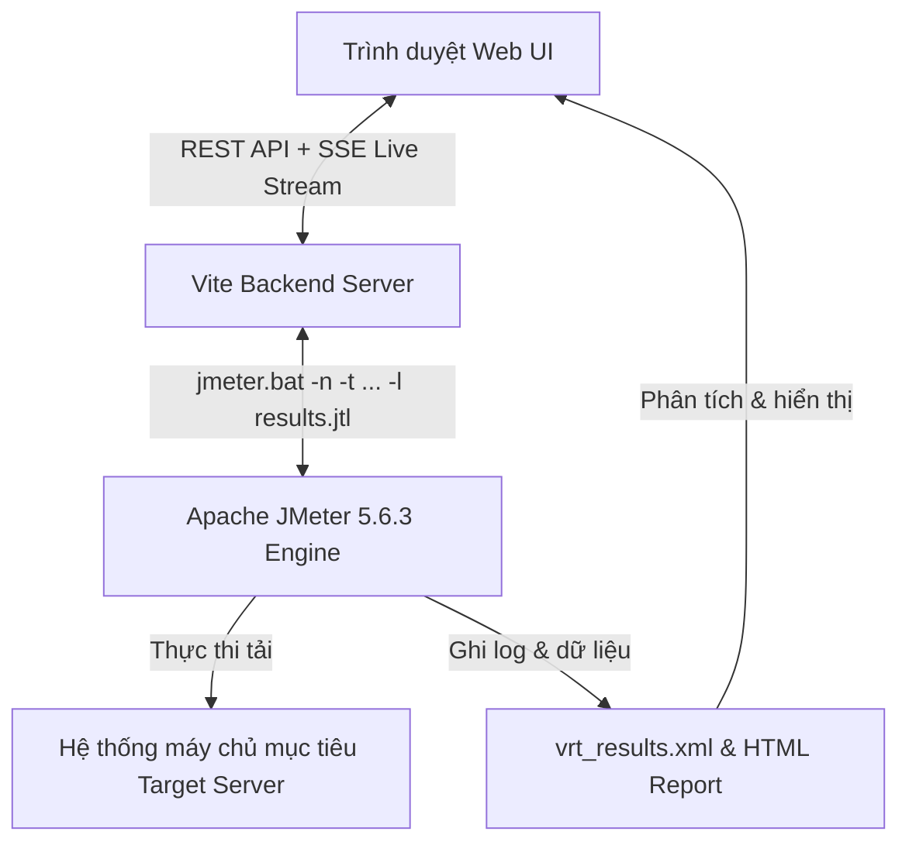

# 📖 Hướng Dẫn Sử Dụng & Sổ Tay Tính Năng JMeter Web UI
> **Tài liệu hướng dẫn trực quan toàn diện (Visual User Guide & Technical Manual)**  
> Dành cho Performance Tester / QA / Automation Engineer sử dụng **JMeter Web UI** kèm đầy đủ hình ảnh minh họa thực tế từ trình duyệt.

---

## 📑 Mục lục
1. [Giới thiệu tổng quan & Giao diện chính](#1-giới-thiệu-tổng-quan--giao-diện-chính)
2. [Tiêu chuẩn UI/UX Mới & Luồng Hộp Thoại Tập Trung (Unified Modal System)](#2-tiêu-chuẩn-uiux-mới--luồng-hộp-thoại-tập-trung-unified-modal-system)
3. [Quản lý Cây kịch bản kiểm thử (Test Plan Tree) & Kéo thả](#3-quản-lý-cây-kịch-bản-kiểm-thử-test-plan-tree--kéo-thả)
4. [Tính năng Import từ cURL (Tools -> Import from cURL)](#4-tính-năng-import-từ-curl-tools---import-from-curl)
5. [Trình xem kết quả (View Results Tree) chuẩn Apache JMeter](#5-trình-xem-kết-quả-view-results-tree-chuẩn-apache-jmeter)
6. [Trình quản lý Plugins (JMeter Plugins Manager)](#6-trình-quản-lý-plugins-jmeter-plugins-manager)
7. [Thực thi, Giám sát Console & Điều khiển Runner (Stop / Force Stop)](#7-thực-thi-giám-sát-console--điều-khiển-runner-stop--force-stop)
8. [Trình soạn thảo mã (Code Editor) cho JSON & Groovy JSR223](#8-trình-soạn-thảo-mã-code-editor-cho-json--groovy-jsr223)
9. [Cơ chế tự động đồng bộ dữ liệu & File CSV (Asset Sync)](#9-cơ-chế-tự-động-đồng-bộ-dữ-liệu--file-csv-asset-sync)
10. [Trình ghi lưu lượng mạng trình duyệt (Browser Network Recorder) & Nhập HAR](#10-trình-ghi-lưu-lượng-mạng-trình-duyệt-browser-network-recorder--nhập-har)
11. [Tự động bắt biến & Tương quan thông minh (Auto-Correlation Engine)](#11-tự-động-bắt-biến--tương-quan-thông-minh-auto-correlation-engine)
12. [Cổng chất lượng SLA & Thông báo Webhook (SLA Quality Gates & Alerting)](#12-cổng-chất-lượng-sla--thông-báo-webhook-sla-quality-gates--alerting)
13. [Thư viện kịch bản mẫu doanh nghiệp (Enterprise Template Gallery)](#13-thư-viện-kịch-bản-mẫu-doanh-nghiệp-enterprise-template-gallery)
14. [Biểu đồ đường cong tải & Mô hình đồng thời (Workload Curve & Concurrency Profile)](#14-biểu-đồ-đường-cong-tải--mô-hình-đồng-thời-workload-curve--concurrency-profile)
15. [Quản lý phiên bản Git & So sánh trực quan (Git Version Control & Visual Diff)](#15-quản-lý-phiên-bản-git--so-sánh-trực-quan-git-version-control--visual-diff)
16. [Trình quản lý tài nguyên dự án (Project Asset Manager)](#16-trình-quản-lý-tài-nguyên-dự-án-project-asset-manager)
17. [Bảng tổng hợp Phím tắt (Keyboard Shortcuts)](#17-bảng-tổng-hợp-phím-tắt-keyboard-shortcuts)

---

## 1. Giới thiệu tổng quan & Giao diện chính

**JMeter Web UI** là nền tảng giao diện web hiện đại, mượt mà và trực quan được xây dựng trên **React, TypeScript và Vite**, kết nối trực tiếp với **Apache JMeter Engine** trên máy tính:

### 📸 Giao diện tổng quan của hệ thống:

### 2 Chế độ thực thi:
1. **Real JMeter Execution Mode (Chế độ thật)**:
   - Hệ thống tự động phát hiện bản cài đặt Apache JMeter trên máy (ví dụ `apache-jmeter-5.6.3`).
   - Biên dịch Test Plan thành file `.jmx` và khởi chạy tiến trình Java JMeter Non-GUI (`jmeter.bat -n -t ...`).
   - Tự động sinh báo cáo HTML Dashboard Report và ghi log thời gian thực.
2. **Mock Simulation Mode (Chế độ mô phỏng)**:
   - Chạy mô phỏng không cần Java/JMeter, thích hợp để dựng kịch bản, kiểm tra luồng logic nhanh.

> [!TIP]
> Bạn có thể bấm vào huy hiệu **Mode Badge** ở góc trên bên phải thanh công cụ để mở hộp thoại cấu hình môi trường JMeter bất cứ lúc nào.

---

## 2. Tiêu chuẩn UI/UX Mới & Luồng Hộp Thoại Tập Trung (Unified Modal System)

Để mang lại trải nghiệm làm việc mượt mà, tiện lợi, đạt chuẩn thiết kế công nghiệp và không làm gián đoạn người dùng, JMeter Web UI đã được tái thiết kế toàn diện với hệ thống quy chuẩn sau:

### 2.1. Lớp phủ Mờ Cố định (Fixed Overlay - Tuyệt đối không xô đẩy giao diện)
- **Vấn đề trước đây**: Khi click mở các tính năng trên thanh công cụ, hộp thoại bị render chèn vào tài liệu làm dịch chuyển thanh toolbar, cây Test Plan và editor xuống dưới, gây giật màn hình và khó chịu.
- **Giải pháp chuẩn hóa**: Mọi hộp thoại giờ đây đều hiển thị trên một lớp phủ mờ cố định (`position: fixed; inset: 0; z-index: 9999; backdrop-filter: blur(5px)`). Cây Test Plan, Toolbar và Editor hoàn toàn đứng yên, ổn định 100%.

### 2.2. Luồng Điều khiển Hộp thoại Duy nhất (Single Active Modal Flow)
- **Không chồng chéo (No Modal Stacking)**: Khi bạn đang mở một hộp thoại (ví dụ: Git) và bấm sang một nút khác trên Toolbar (ví dụ: SLA hoặc Templates), hệ thống sẽ **tự động đóng hộp thoại cũ và kích hoạt hộp thoại mới**.
- **Đóng nhanh tiện lợi**:
  - Nhấn phím **`Escape`** bất kỳ lúc nào để đóng hộp thoại đang mở.
  - Hoặc click chuột vào vùng nền mờ bên ngoài hộp thoại.
  - Hoặc bấm lại chính nút icon đó trên thanh công cụ (toggle behavior).
- **Đồng bộ trạng thái trực quan**: Nút công cụ tương ứng trên Toolbar tự động hiển thị viền xanh nổi bật (`.active-tool`) giúp bạn luôn nhận biết rõ ràng tính năng nào đang được mở.

### 2.3. Giao diện Sáng Độ Tương Phản Cao (High-Contrast Light Theme)
- Khắc phục triệt để tình trạng chữ mờ, chìm vào nền tối trước đây. Toàn bộ hộp thoại được chuẩn hóa sang **Theme Sáng Tinh Khiết (`#ffffff`)** với viền xám mềm (`#cbd5e1`) và bóng đổ nổi bật.
- **Tiêu đề & Nhãn form**: Sử dụng màu xám đen đậm (`#0f172a` / `#1e293b`), font chữ sắc nét đạt chuẩn độ tương phản cao **WCAG AAA**.
- **Ô nhập liệu (Inputs & Selects)**: Nền trắng với viền rõ ràng, khi focus có viền xanh dương hiện đại (`#2563eb`), chữ nhập màu đen đậm cực kỳ dễ đọc.

### 2.4. Bố cục Master-Detail Song Song (Side-by-Side View)
- Đối với các hộp thoại có luồng danh sách và nội dung chi tiết (như **Git Version Control & Visual Diff**):
  - **Cột trái (380px)**: Danh sách file thay đổi kèm ô tìm kiếm lọc nhanh tức thì, thông tin trạng thái file và khung soạn tin nhắn commit ghim cố định ở đáy.
  - **Cột phải (toàn bộ phần còn lại)**: Khung xem diff mã nguồn với chiều cao tối đa, hiển thị trực quan dòng thêm/xóa.
  - Khi click chọn bất kỳ file nào ở cột trái, khung diff bên phải cập nhật ngay lập tức mà **cả 2 bên đều giữ nguyên kích thước ổn định**, không bị co giật hay chèn ép lẫn nhau.

### 2.5. Kiến trúc Cuộn Độc Lập Cho Editor & Bảng Biến
- Khung cấu hình component và các bảng biến dài (User Defined Variables, Parameters) được tách biệt luồng cuộn dọc riêng biệt (`.editor-scroll`). Dù bảng có hàng chục hoặc hàng trăm dòng dữ liệu, thanh cuộn hoạt động mượt mà và nút **`+ Add`** ở chân bảng luôn luôn tiếp cận được.

---

## 3. Quản lý Cây kịch bản kiểm thử (Test Plan Tree) & Kéo thả

Cây kịch bản bên trái quản lý toàn bộ cấu trúc phân cấp của Test Plan theo chuẩn Apache JMeter.

### 2.1. Menu chuột phải (Context Menu) & Thêm thành phần
Click chuột phải vào bất kỳ node nào trên cây để mở menu thao tác phân cấp chuẩn JMeter:
- **Add**: Phân loại theo từng nhóm thành phần chuẩn (*Threads, Samplers, Logic Controllers, Pre Processors, Post Processors, Assertions, Timers, Config Elements, Listeners*).
- **Import from cURL…**: Nhập câu lệnh cURL trực tiếp vào vị trí đang chọn.
- **Cut (`Ctrl+X`) / Copy (`Ctrl+C`) / Paste (`Ctrl+V`) / Duplicate (`Ctrl+D`)**.
- **Remove (`Delete`) / Disable / Enable / Rename (`F2`)**.
- **Move to Top / Move Up / Move Down / Move to Bottom**.

### 2.2. Thao tác Kéo & Thả (Drag & Drop)
- **Sắp xếp thứ tự**: Kéo một component thả lên trên hoặc dưới component khác để đổi vị trí.
- **Di chuyển vào container**: Kéo Sampler/Timer thả vào bên trong một Thread Group hoặc Logic Controller.
- **Kéo thả File từ máy tính**: Kéo file `.jmx`, `.jtl`, `.csv`, `.xml` từ Windows Explorer thả trực tiếp vào cửa sổ trình duyệt để tự động nạp dữ liệu.

---

## 3. Tính năng Import từ cURL (Tools -> Import from cURL)

Cho phép nhập nhanh bất kỳ yêu cầu API nào từ DevTools của trình duyệt hoặc Postman thành component của JMeter.

### 3.1. Mở menu Import from cURL
Truy cập menu **`Tools -> Import from cURL…`** (hoặc click chuột phải trên cây -> `Import from cURL…`, hoặc bấm nút cURL trên Toolbar):

---

### 3.2. Hộp thoại Live Preview cURL
Dán câu lệnh cURL vào ô nhập liệu. Hệ thống sẽ **Live Preview** tách toàn bộ Method, Domain, Path, Headers và Body Data theo thời gian thực:

---

### 3.3. Tự động sinh HTTP Request & HTTP Header Manager
Bấm **Import into Test Plan**, hệ thống sẽ tự động tạo sampler **`HTTP Request`** và node con **`HTTP Header Manager`** tương ứng:

---

## 4. Trình xem kết quả (View Results Tree) chuẩn Apache JMeter

Bộ hiển thị kết quả chi tiết của JMeter được tái hiện đầy đủ với 3 tab:

### 4.1. Tab Sampler Result
Xem toàn bộ thông số chi tiết: Mã phản hồi (`200 OK`, `500`), Load time, Connect time, Latency, Data size, Headers size, Content type.

---

### 4.2. Tab Request & Tự động sinh cURL Code Snippet (Chuẩn Postman)
Hiển thị đầy đủ thông tin gửi đi với cấu trúc **Code snippet cURL** giống hệt Postman:
- Tự động tách từng `--header '<name>: <value>' \` trên mỗi dòng.
- Định dạng JSON Body trong `--data-raw '{ ... }'`.
- Nút **Copy cURL** sao chép trực tiếp lệnh CLI để chạy ngay trong Terminal hoặc import vào Postman/Insomnia.

---

### 4.3. Tab Response data (Giao diện chuẩn Postman & JMeter)
Tái hiện trung thực giao diện Response Inspector phong cách Postman:
- **Thanh trạng thái đầu trang**: Hiển thị trực quan mã **`200 OK`**, thời gian phản hồi (**`894 ms`**), kích thước (**`29.81 KB`**) và nút **`Save Response`** (tải tệp `.json`).
- **Các tab phụ**: **`Body`**, **`Cookies`**, **`Headers (7)`**, **`Test Results (Pass/Fail)`**.
- **Bộ công cụ xem JSON**: Hỗ trợ chuyển đổi **`JSON (Pretty)`**, **`Raw`**, **`Preview`**, thanh tìm kiếm nội dung và nút sao chép nhanh.
- **Tự động giải mã Unicode tiếng Việt**: Toàn bộ ký tự tiếng Việt có dấu được giải mã chuẩn xác, hiển thị trực quan và dễ đọc.

---

## 5. Trình quản lý Plugins (JMeter Plugins Manager)

Tương thích hoàn toàn với hệ sinh thái mở rộng của `jmeter-plugins.org`.

### Vị trí mở:
- Menu **`Options -> Plugins Manager…`** hoặc **`Tools -> Plugins Manager…`**

---

### 5.1. Tab Available Plugins (Kho Plugin chính thức)
Kho plugin phong phú (*Custom Thread Groups, Dummy Sampler, Throughput Shaping Timer, Flexible File Writer, 3 Basic Graphs, AutoStop Listener, WebSocket Samplers, Custom Functions...*). Bạn chỉ cần chọn plugin và bấm **`Install Plugin`**:

---

### 5.2. Tab Installed Plugins (Quản lý các plugin đã cài)
Tự động quét toàn bộ file `.jar` trong `lib/ext` và `lib` của JMeter, hiển thị phiên bản, dung lượng và đường dẫn cài đặt:

---

## 6. Thực thi, Giám sát Console & Điều khiển Runner (Stop / Force Stop)

### 6.1. Khởi chạy & Giám sát Live Console
Bấm nút **Play (▶️)** trên Toolbar hoặc phím tắt **`Ctrl+R`**. Mở Live Console Log (icon Terminal 🖥️) để theo dõi tiến trình chạy thời gian thực:

---

### 6.2. Dừng Test & Force Stop
- **Nút Stop (⏹️ ô vuông đỏ)** và **Shutdown (⏸️)** trên Toolbar luôn luôn sáng và bấm được bất kỳ lúc nào.
- Khi có tiến trình ngầm cần dọn dẹp, nút **`Force Stop & Reset`** màu đỏ trên thanh thông báo sẽ lập tức gọi `taskkill /F` để giải phóng tiến trình Java:

---

## 7. Trình soạn thảo mã (Code Editor) cho JSON & Groovy JSR223

### 7.1. Trình soạn thảo JSON Body
Tích hợp trong **HTTP Request** với số dòng code, tô màu cú pháp và nút **Prettify JSON** tự động căn lề chuẩn đẹp:

---

### 7.2. Trình soạn thảo JSR223 (Groovy / JavaScript / BeanShell)
Tích hợp trong **JSR223 Sampler**, **PreProcessor**, **PostProcessor**, **Assertion** với các đối tượng `vars`, `props`, `prev`:

---

## 8. Cơ chế tự động đồng bộ dữ liệu & File CSV (Asset Sync)

Khi chạy kịch bản với JMeter CLI, đường dẫn làm việc mặc định chuyển về thư mục `runs/run_XXXX/`. Hệ thống được tích hợp bộ đồng bộ tài nguyên tự động:
- Tự động sao chép các thư mục dữ liệu nguồn (`data/`, `GPKD/`, `downloads/`) vào thư mục chạy `runs/run_XXXX/` trước khi JMeter khởi động.
- Giúp các biểu thức Java/Groovy như `FileServer.getFileServer().getBaseDir() + "/data/provinces.csv"` hay component `CSV Data Set Config` luôn tìm thấy file chính xác 100%, không bị lỗi `NoSuchFileException`.

---

## 9. Trình ghi lưu lượng mạng trình duyệt (Browser Network Recorder) & Nhập HAR

Bộ ghi lưu lượng mạng tích hợp cho phép bạn bắt trọn vẹn hành vi người dùng thực tế trên trình duyệt web và tự động chuyển đổi thành kịch bản JMeter:

### 9.1. Khởi chạy Browser Recorder
- Bấm vào icon **Recorder (Quả cầu / Radar)** trên thanh Toolbar hoặc menu `Tools -> Browser Network Recorder…`.
- Hệ thống hỗ trợ 2 chế độ:
  1. **Live Chrome/Edge CDP Recording**: Tự động mở một cửa sổ Chrome/Edge độc lập, đính kèm kết nối qua Chrome DevTools Protocol để ghi lại toàn bộ request và response payload.
  2. **Import HAR File**: Kéo thả hoặc duyệt file `.har` được xuất từ bất kỳ công cụ nào (Chrome, Firefox, Safari, Charles Proxy, Fiddler).

### 9.2. Lọc thông minh & Tự động tạo Sampler
- Tự động bỏ qua các tài nguyên tĩnh không cần thiết (`.png`, `.jpg`, `.css`, `.woff2`, `.svg`).
- Lọc theo Domain hoặc URL Pattern để chỉ giữ lại các API cốt lõi.
- Tự động tách Header thành `HTTP Header Manager` tương ứng cho từng request.
- Bấm **Import into Test Plan** để đưa toàn bộ luồng vừa ghi vào cây kịch bản.

---

## 10. Tự động bắt biến & Tương quan thông minh (Auto-Correlation Engine)

Giải quyết bài toán tốn nhiều thời gian nhất của kiểm thử hiệu năng: xử lý dynamic tokens (Access Tokens, JWT, CSRF, Session IDs).

### 10.1. Mở Correlation Wizard
- Click menu `Tools -> Auto-Correlation Wizard…` hoặc nút Correlation trên Toolbar.
- Thuật toán tự động quét toàn bộ chuỗi Request và Response trong kịch bản.

### 10.2. Cơ chế nhận diện & Thay thế
- **Phát hiện thông minh**: Nhận diện chuỗi token trong JSON body (ví dụ `token`, `access_token`, `accessToken`, `jwt`, `csrf_token`, `_csrf`, `sessionId`).
- **Tự động chèn Post-Processor**: Tự động sinh `JSONExtractor` (hoặc `RegexExtractor`) tại sampler sinh token.
- **Tự động tham số hóa**: Thay thế toàn bộ các chuỗi giá trị cứng ở các request tiếp theo thành `${access_token}` hoặc `${session_id}`.

---

## 11. Cổng chất lượng SLA & Thông báo Webhook (SLA Quality Gates & Alerting)

Tích hợp tiêu chuẩn đánh giá hiệu năng vào quy trình CI/CD với hệ thống cảnh báo tự động:

### 11.1. Thiết lập ngưỡng SLA (Thresholds)
- Mở hộp thoại **SLA Quality Gates** (icon chiếc khiên xanh trên Toolbar).
- Cấu hình các tiêu chí chặn:
  - **Max Average Latency (ms)**: Độ trễ trung bình tối đa cho phép.
  - **Max 95th Percentile Latency (ms)**: Ngưỡng P95 tối đa.
  - **Max 99th Percentile Latency (ms)**: Ngưỡng P99 tối đa.
  - **Max Tolerated Error Rate (%)**: Tỷ lệ lỗi tối đa cho phép (ví dụ `0.5%`).
  - **Min Expected Throughput (req/s)**: Thông lượng tối thiểu kỳ vọng.

### 11.2. Cấu hình Webhook Thông báo (Discord, Slack, MS Teams)
- Bật tùy chọn **Send Webhook notification on test run completion**.
- Chọn nền tảng (Discord / Slack / Teams) và dán URL Webhook.
- Chọn gửi khi **SLA Passed** hoặc **SLA Failed/Breached**.
- Bấm **Test Webhook Notification** để kiểm tra gửi thử một tin nhắn Rich Embed trực tiếp vào channel chat của team.

---

## 12. Thư viện kịch bản mẫu doanh nghiệp (Enterprise Template Gallery)

Cung cấp 6 blueprint kịch bản kiểm thử chuẩn công nghiệp để scaffold nhanh trong 1 giây:

1. **E-Commerce End-to-End Checkout Flow**: Kịch bản luồng người dùng hoàn chỉnh (Browse Catalog -> Product Search -> Add to Cart -> Token Authentication -> Order Checkout) kèm bộ dữ liệu CSV.
2. **Microservices REST API Smoke & Load**: Kiểm tra tự động các API Health Checks, REST CRUD operations với UUID động từ script JSR223 Groovy.
3. **OAuth2 Concurrency & Endurance Soak**: Thiết kế cho kiểm thử độ chịu tải ngâm dài hạn (3600s) để phát hiện rò rỉ bộ nhớ (Memory Leaks) và suy giảm hiệu năng.
4. **Step-Up Concurrency Stress Test**: Tăng dần tải theo từng bước (+50 users mỗi 30s) để tìm điểm gãy của hệ thống và đẩy chỉ số về InfluxDB.
5. **GraphQL API Queries & Mutations**: Kịch bản thực thi các câu truy vấn và biến đổi GraphQL tham số hóa kèm kiểm tra schema.
6. **WebSocket Realtime Messaging & Stream**: Mở kết nối WebSocket TLS bền bỉ, gửi nhận ping heartbeat và frames dữ liệu thời gian thực.

---

## 13. Biểu đồ đường cong tải & Mô hình đồng thời (Workload Curve & Concurrency Profile)

Mở hộp thoại **Workload Curve** (icon sóng nhịp tim trên Toolbar) để xem trực quan mô hình tải:
- **Combined System Workload Curve**: Biểu đồ mô phỏng tổng số người dùng đồng thời (VUs) theo thời gian của toàn bộ các Thread Group cộng gộp.
- **Thống kê tổng thể**: Peak Concurrency (VUs cao nhất), Total Duration (thời gian chạy tổng), số Thread Groups đang hoạt động.
- **Phân tách chi tiết**: Xem biểu đồ riêng cho từng Stepping Thread Group, Ultimate Thread Group hoặc Concurrency Thread Group trong kịch bản.

---

## 14. Quản lý phiên bản Git & So sánh trực quan (Git Version Control & Visual Diff)

Tích hợp giao diện quản lý phiên bản chuẩn mực theo phong cách Master-Detail song song (Side-by-Side):

### 14.1. Khung bên trái (Danh sách thay đổi & Commit)
- **Thống kê thay đổi**: Đếm số file đang sửa đổi (MOD), tạo mới (NEW/ADD) hoặc xóa (DEL).
- **Lọc file nhanh**: Ô `Search changed files...` giúp tìm ngay lập tức file cần kiểm tra trong hàng chục file.
- **Nút Pull**: Kéo mã mới nhất từ remote Git repository.
- **Soạn tin nhắn Commit**: Khung nhập tin nhắn và 2 nút **Commit** hoặc **Commit & Push** trực tiếp lên GitHub/GitLab.

### 14.2. Khung bên phải (Visual Diff Code)
- Hiển thị toàn bộ chiều cao của phần diff code tương ứng với file đang chọn bên trái.
- Tô màu cú pháp chuẩn: Màu xanh lá cho dòng thêm mới (`+`), màu đỏ cho dòng bị xóa (`-`), màu xanh dương cho chunk header (`@@`).
- Kích thước hai bên độc lập, cuộn mượt mà không bị co giật hay chèn ép khung hình.

---

## 15. Trình quản lý tài nguyên dự án (Project Asset Manager)

Mở hộp thoại **Asset Manager** (icon thư mục trên Toolbar) để quản lý tập trung các tệp đính kèm phục vụ kiểm thử:
- Quản lý các file CSV tham số hóa dữ liệu trong thư mục `data/`.
- Quản lý các file PDF/ảnh upload trong thư mục `GPKD/` hoặc `downloads/`.
- Hỗ trợ tải tệp mới lên, tải tệp về máy tính hoặc xóa tệp cũ an toàn.
- Hệ thống tự động đồng bộ các tệp này vào thư mục chạy `runs/run_XXXX/` của JMeter khi khởi động test run.

---

## 16. Bảng tổng hợp Phím tắt (Keyboard Shortcuts)

| Phím tắt | Thao tác | Mô tả |
| :--- | :--- | :--- |
| **`Ctrl + N`** | New Plan | Tạo kịch bản kiểm thử mới |
| **`Ctrl + O`** | Open JMX | Mở file `.jmx` từ máy tính |
| **`Ctrl + S`** | Save | Lưu kịch bản (tự động lưu vào local storage) |
| **`Ctrl + R`** | Start Run | Khởi chạy kịch bản kiểm thử |
| **`Ctrl + X`** | Cut | Cắt node đang chọn |
| **`Ctrl + C`** | Copy | Sao chép node đang chọn |
| **`Ctrl + V`** | Paste | Dán node vào vị trí đang chọn |
| **`Ctrl + D`** | Duplicate | Nhân bản node đang chọn |
| **`Delete`** | Remove | Xóa node đang chọn |
| **`F2`** | Rename | Đổi tên node đang chọn |
| **`Escape`** | Close | Đóng nhanh bất kỳ hộp thoại popup nào |

---

*Tài liệu được biên soạn tự động và cập nhật theo phiên bản mới nhất của JMeter Web UI.*
